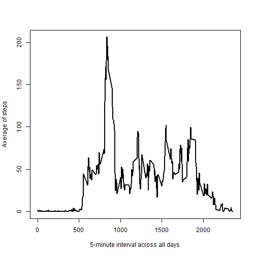
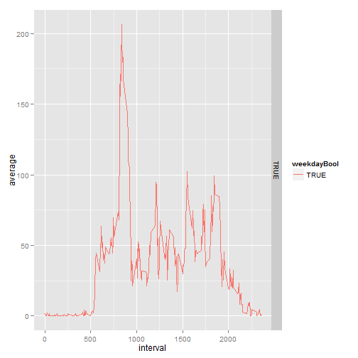

## Loading and preprocessing the data

Loading the data & Processing and transforming the data.


```r
# Uncompressing activity.zip file
unzip("activity.zip")

# Loading Data and processing the data
data <- read.csv("activity.csv", colClasses = c(NA,"Date",NA), na.strings = "NA")
```

## What is mean total number of steps taken per day?

1. Make a histogram of the total number of steps taken each day. 


```
## Warning: Removed 2304 rows containing missing values (stat_summary).
```

 

2. Calculate and report the *mean* and *median* total number of steps taken per day.


```r
# Calculating the mean & median of total number of steps taken per day
mean <- aggregate(data$steps, by = list(data$date), FUN=mean, na.rm = TRUE)
median <- aggregate(data$steps, by = list(data$date), FUN=median, na.rm = TRUE)

# Showing the results merged the first column is the Date the second the Mean and the third is the Median
merge(mean, median, by = "Group.1")
```

```
##       Group.1        x.x x.y
## 1  2012-10-01        NaN  NA
## 2  2012-10-02  0.4375000   0
## 3  2012-10-03 39.4166667   0
## 4  2012-10-04 42.0694444   0
## 5  2012-10-05 46.1597222   0
## 6  2012-10-06 53.5416667   0
## 7  2012-10-07 38.2465278   0
## 8  2012-10-08        NaN  NA
## 9  2012-10-09 44.4826389   0
## 10 2012-10-10 34.3750000   0
## 11 2012-10-11 35.7777778   0
## 12 2012-10-12 60.3541667   0
## 13 2012-10-13 43.1458333   0
## 14 2012-10-14 52.4236111   0
## 15 2012-10-15 35.2048611   0
## 16 2012-10-16 52.3750000   0
## 17 2012-10-17 46.7083333   0
## 18 2012-10-18 34.9166667   0
## 19 2012-10-19 41.0729167   0
## 20 2012-10-20 36.0937500   0
## 21 2012-10-21 30.6284722   0
## 22 2012-10-22 46.7361111   0
## 23 2012-10-23 30.9652778   0
## 24 2012-10-24 29.0104167   0
## 25 2012-10-25  8.6527778   0
## 26 2012-10-26 23.5347222   0
## 27 2012-10-27 35.1354167   0
## 28 2012-10-28 39.7847222   0
## 29 2012-10-29 17.4236111   0
## 30 2012-10-30 34.0937500   0
## 31 2012-10-31 53.5208333   0
## 32 2012-11-01        NaN  NA
## 33 2012-11-02 36.8055556   0
## 34 2012-11-03 36.7048611   0
## 35 2012-11-04        NaN  NA
## 36 2012-11-05 36.2465278   0
## 37 2012-11-06 28.9375000   0
## 38 2012-11-07 44.7326389   0
## 39 2012-11-08 11.1770833   0
## 40 2012-11-09        NaN  NA
## 41 2012-11-10        NaN  NA
## 42 2012-11-11 43.7777778   0
## 43 2012-11-12 37.3784722   0
## 44 2012-11-13 25.4722222   0
## 45 2012-11-14        NaN  NA
## 46 2012-11-15  0.1423611   0
## 47 2012-11-16 18.8923611   0
## 48 2012-11-17 49.7881944   0
## 49 2012-11-18 52.4652778   0
## 50 2012-11-19 30.6979167   0
## 51 2012-11-20 15.5277778   0
## 52 2012-11-21 44.3993056   0
## 53 2012-11-22 70.9270833   0
## 54 2012-11-23 73.5902778   0
## 55 2012-11-24 50.2708333   0
## 56 2012-11-25 41.0902778   0
## 57 2012-11-26 38.7569444   0
## 58 2012-11-27 47.3819444   0
## 59 2012-11-28 35.3576389   0
## 60 2012-11-29 24.4687500   0
## 61 2012-11-30        NaN  NA
```

## What is the average daily activity pattern?

1. Make a time series plot of the 5-minute interval (x-axis) and the average number of steps taken, averaged across all days (y-axis).

 

2. Which 5-minute interval, on average across all the days in the dataset, contains the maximum number of steps?


```r
# Getting the maximum number of steps on average across all the days
maxAve <- max(average)

# Getting the 5-minute interval of the maximum number of steps on average across all the days
averageDF <- data.frame(average)
averageDF[averageDF[1] == maxAve, ]
```

```
##      835 
## 206.1698
```

The 5-minute interval with the maximum number of steps on average across all the days in the dataset is *835*.

## Imputing missing values

1. Calculate and report the total number of missing values in the dataset.


```r
# Getting total number of missing values in the dataset
sum(is.na(data$steps))
```

```
## [1] 2304
```

2. Devise a strategy for filling in all of the missing values in the dataset. Creating a new dataset that is equal to the original dataset but with the missing data filled in


```r
# Clonning the original dataset
dataNoNA <- data

# Replacing the NAs by the value of the mean in the corresponding interval
dataNoNAFaverage <- aggregate(data$steps, by = list(data$interval), FUN=mean, na.rm=TRUE)
for (i in 1:nrow(dataNoNA)){
  if (is.na(dataNoNA$steps[i])) { 
    dataNoNA$steps[i] <- dataNoNAFaverage[dataNoNAFaverage$Group.1 == as.character(dataNoNA$interval[i]), "x"]
  }
}
```

3. Make a histogram of the total number of steps taken each day and calculate and report the *mean* and *median* total number of steps taken per day.


```r
# Plotting a histogram of the total number of steps taken each day
qplot(date, steps, data=dataNoNA, stat="summary", fun.y="sum", geom="bar")
```

 

```r
# Calculating the mean & median of total number of steps taken per day
meanNoNA <- aggregate(dataNoNA$steps, by = list(dataNoNA$date), FUN=mean, na.rm = TRUE)
medianNoNA <- aggregate(dataNoNA$steps, by = list(dataNoNA$date), FUN=median, na.rm = TRUE)

# Showing the results merged the first column is the Date the second the Mean and the third is the Median
merge(meanNoNA, medianNoNA, by = "Group.1")
```

```
##       Group.1        x.x      x.y
## 1  2012-10-01 37.3825996 34.11321
## 2  2012-10-02  0.4375000  0.00000
## 3  2012-10-03 39.4166667  0.00000
## 4  2012-10-04 42.0694444  0.00000
## 5  2012-10-05 46.1597222  0.00000
## 6  2012-10-06 53.5416667  0.00000
## 7  2012-10-07 38.2465278  0.00000
## 8  2012-10-08 37.3825996 34.11321
## 9  2012-10-09 44.4826389  0.00000
## 10 2012-10-10 34.3750000  0.00000
## 11 2012-10-11 35.7777778  0.00000
## 12 2012-10-12 60.3541667  0.00000
## 13 2012-10-13 43.1458333  0.00000
## 14 2012-10-14 52.4236111  0.00000
## 15 2012-10-15 35.2048611  0.00000
## 16 2012-10-16 52.3750000  0.00000
## 17 2012-10-17 46.7083333  0.00000
## 18 2012-10-18 34.9166667  0.00000
## 19 2012-10-19 41.0729167  0.00000
## 20 2012-10-20 36.0937500  0.00000
## 21 2012-10-21 30.6284722  0.00000
## 22 2012-10-22 46.7361111  0.00000
## 23 2012-10-23 30.9652778  0.00000
## 24 2012-10-24 29.0104167  0.00000
## 25 2012-10-25  8.6527778  0.00000
## 26 2012-10-26 23.5347222  0.00000
## 27 2012-10-27 35.1354167  0.00000
## 28 2012-10-28 39.7847222  0.00000
## 29 2012-10-29 17.4236111  0.00000
## 30 2012-10-30 34.0937500  0.00000
## 31 2012-10-31 53.5208333  0.00000
## 32 2012-11-01 37.3825996 34.11321
## 33 2012-11-02 36.8055556  0.00000
## 34 2012-11-03 36.7048611  0.00000
## 35 2012-11-04 37.3825996 34.11321
## 36 2012-11-05 36.2465278  0.00000
## 37 2012-11-06 28.9375000  0.00000
## 38 2012-11-07 44.7326389  0.00000
## 39 2012-11-08 11.1770833  0.00000
## 40 2012-11-09 37.3825996 34.11321
## 41 2012-11-10 37.3825996 34.11321
## 42 2012-11-11 43.7777778  0.00000
## 43 2012-11-12 37.3784722  0.00000
## 44 2012-11-13 25.4722222  0.00000
## 45 2012-11-14 37.3825996 34.11321
## 46 2012-11-15  0.1423611  0.00000
## 47 2012-11-16 18.8923611  0.00000
## 48 2012-11-17 49.7881944  0.00000
## 49 2012-11-18 52.4652778  0.00000
## 50 2012-11-19 30.6979167  0.00000
## 51 2012-11-20 15.5277778  0.00000
## 52 2012-11-21 44.3993056  0.00000
## 53 2012-11-22 70.9270833  0.00000
## 54 2012-11-23 73.5902778  0.00000
## 55 2012-11-24 50.2708333  0.00000
## 56 2012-11-25 41.0902778  0.00000
## 57 2012-11-26 38.7569444  0.00000
## 58 2012-11-27 47.3819444  0.00000
## 59 2012-11-28 35.3576389  0.00000
## 60 2012-11-29 24.4687500  0.00000
## 61 2012-11-30 37.3825996 34.11321
```

Do these values differ from the estimates from the first part of the assignment?

Yes, the differ from the estimates from the first part of the assignment, there is no missing values so the data is "completed"

What is the impact of imputing missing data on the estimates of the total daily number of steps?

There is a strong impact into the median calculation because previuosly we had NA values that are not in the new results; and a slightly impact into the mean values.

## Are there differences in activity patterns between weekdays and weekends?


```r
# Getting weekdays
dataNoNA$weekday <- weekdays(dataNoNA$date);

for (i in 1:nrow(dataNoNA)){
  if (dataNoNA$weekday[i] == "Saturday" | dataNoNA$weekday[i] == "Sunday" ) { 
    dataNoNA$weekdayBool = FALSE
  } else {
    dataNoNA$weekdayBool = TRUE
  }
}

dataNoNA$weekdayBool <- as.factor(dataNoNA$weekdayBool);

weekAverage <- aggregate(dataNoNA$steps, by=list(dataNoNA$interval, dataNoNA$weekdayBool), FUN=mean, na.rm=TRUE)

names(weekAverage) <- c("interval", "weekdayBool", "average")

qplot(interval, average, data = weekAverage, geom = "line", color = weekdayBool, facets= weekdayBool ~ .)
```

 
